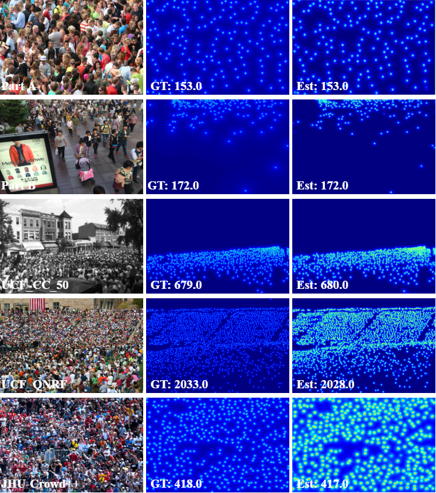

# SDANet: Scale-Deformation Awareness Network for Crowd Counting  
This repository contains the code and resources associated with our paper titled "SDANet: Scale-Deformation Awareness Network for Crowd Counting". Please note that the paper is currently under review for publication.
## Contents

- [Uncertainty-Aware Generalization for Object Counting in Remote Sensing Imagery](#sdanet:scale-deformation-awareness-network-for-crowd-counting)
  - [Contents](#contents)
  - [Introduction](#introduction)
  - [Environment](#environment)
  - [Train](#train)
  - [Test](#test)
  - [Results](#results)
    - [Visual Results](#visual-results)
    - [Quantitative Results](#quantitative-results)
  - [Citation](#citation)

## Introduction
Crowd counting aims to derive information about crowd density by quantifying the number of individuals in an image or video. 
It offers crucial insights applicable to various domains, e.g.,  secure,  efficient decision-making and management.
However, scale variation and irregular shapes of heads pose intricate challenges. 
To address these challenges, we propose a Scale-Deformation Awareness Network (SDANet). 
Specifically, a Scale Awareness (SA) module is introduced to address the scale variation. 
It can capture long-distance dependencies and preserve precise spatial information by re-adjusting weights in height and width directions. 
Concurrently, a Deformation Awareness (DA) module is introduced to solve the challenge of head deformation.
It adjusts the sampling position of the convolution kernel through deformable convolution and learning offset.


## Environment

	python >=3.6 
	pytorch ==2.1.0
	opencv-python ==4.8.1.78
	scipy ==1.10.1
	h5py ==3.10.0
	pillow ==10.0.1
	imageio ==2.31.6
	nni ==3.0 


## Generate FIDT Ground-Truth

```
cd data_process
run  python fidt_generate_xx.py
```

“xx” means the dataset name, including sh, jhu, qnrf. You should change the dataset path.

Generate images file list
```
python npydata.py
```

## Train

1. Download HRNet pretrained model from [HERE](https://1drv.ms/u/s!AoqjtIqKcO-1gg1LztkP37xTPIiw). And modify `Networks/HR_Net/config.py` the model path.
2. Modify `config.py` to specify your own train options. It should be noted that for training data set SHA and B, crop_size should be set to 256, UCF_CC_50, QNRF and JHU should be set to 512.
3. After performing the above modifications, you can start the training process by running `python train.py`.

## Test

1. Modify `config.py` to specify your own test options.
2. After performing the above modifications, you can start the testing process by running
 ```
 python test.py --dataset ShanghaiA --pre ./model/ShanghaiA/model_best.pth --gpu_id 0
 ```
3. Download the pretrained model from [OneDrive](https://1drv.ms/u/s!AoqjtIqKcO-1gg1LztkP37xTPIiw)

## Results

### Visual Results



### Quantitative Results


## Citation

If you find this code or research helpful, please consider citing our paper:

```BibTeX
@article{Wang2024SDANet,
title={SDANet: Scale-Deformation Awareness Network for Crowd Counting},
author={Wang, Jianyong and Guo, Xiangyu and Li, Qilei and Ahmed M. Abdelmoniem and Gao, Mingliang},
journal={under_review}
year={2024},
}
```

Please note that this citation is a placeholder and will be updated with the actual citation information once the paper is accepted and published. We kindly request you to revisit this section and replace the placeholder with the correct citation detail.


